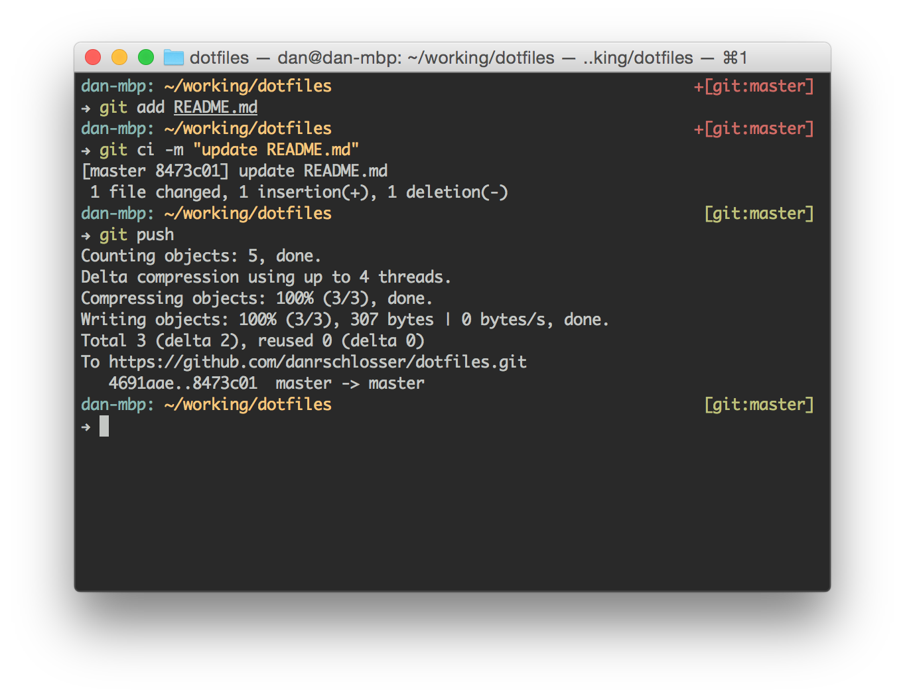

# dotfiles

Working explanation of my dotfiles.  Currently untested. Good luck!  

### Installation

1. Install [Zsh](http://www.zsh.org/). It's like bash, but with *features*.
2. Install [`oh-my-zsh`](https://github.com/robbyrussell/oh-my-zsh). It helps manage Zsh configurations.
3. Copy `danstheme.zsh-theme` into `~/.oh-my-zsh/themes/`.
4. Overwrite `~/.zshrc` with my `.zshrc` file.
5. Install `zsh-syntax-highlighting`.
6. Install the [Tomorrow Night theme](https://github.com/chriskempson/tomorrow-theme).  
    - I use Terminal for Mac OS X, so I just download [this file](https://raw.githubusercontent.com/chriskempson/tomorrow-theme/master/OS%20X%20Terminal/Tomorrow%20Night.terminal).  Then, right click > Open the file, which should open a new terminal window.  Then go to Terminal > Preferences > Profiles tab, scroll all the way down on the left side, select "Tomorrow Night" and click "Default".
7. Change Terminal font to Monaco 12pt.  

### Plugins I use

- [Zsh](http://www.zsh.org/) for autocomplete, and general awesomeness.
- [`oh-my-zsh`](https://github.com/robbyrussell/oh-my-zsh) for plugin management.
- [`zsh-syntax-highlighting`](https://github.com/zsh-users/zsh-syntax-highlighting) for syntax highlighting in the terminal. (Valid commands are colored differently than invalid commands).
- [Tomorrow Night Terminal theme](https://github.com/chriskempson/tomorrow-theme) for beauty.
